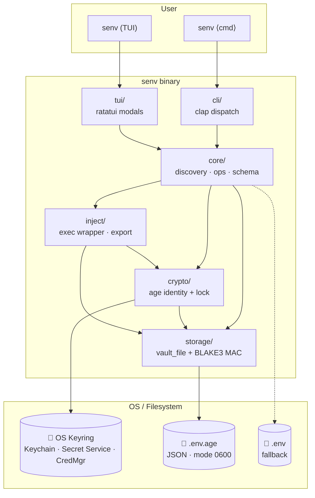
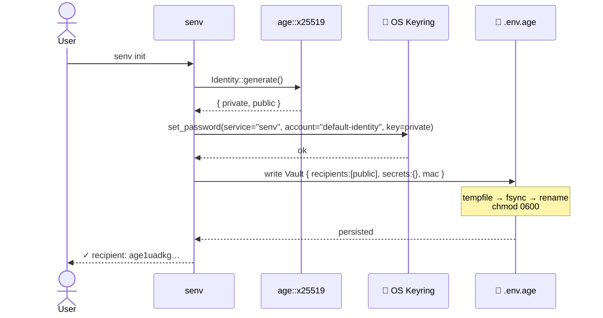
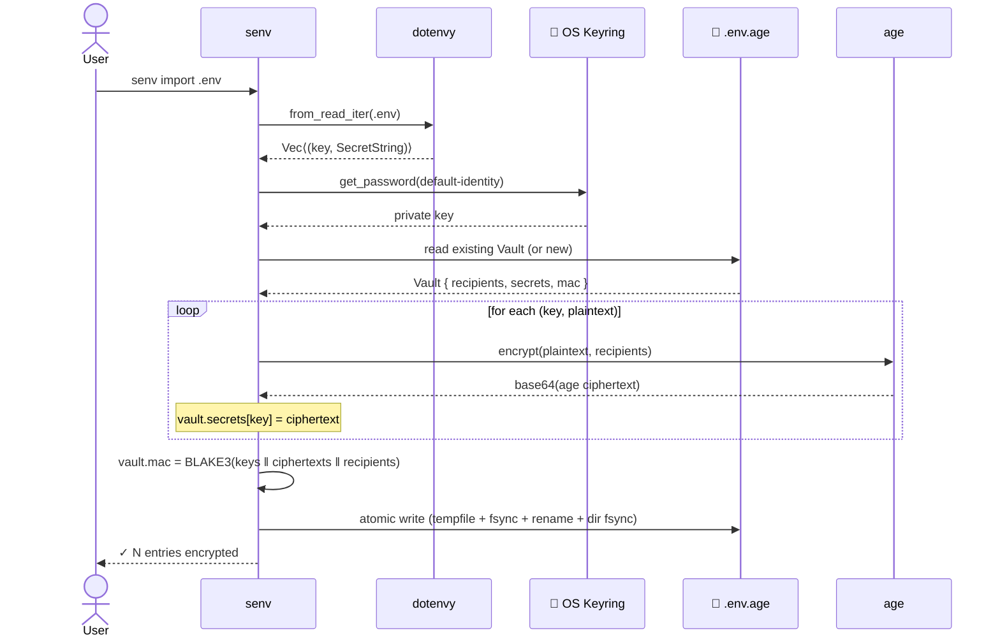
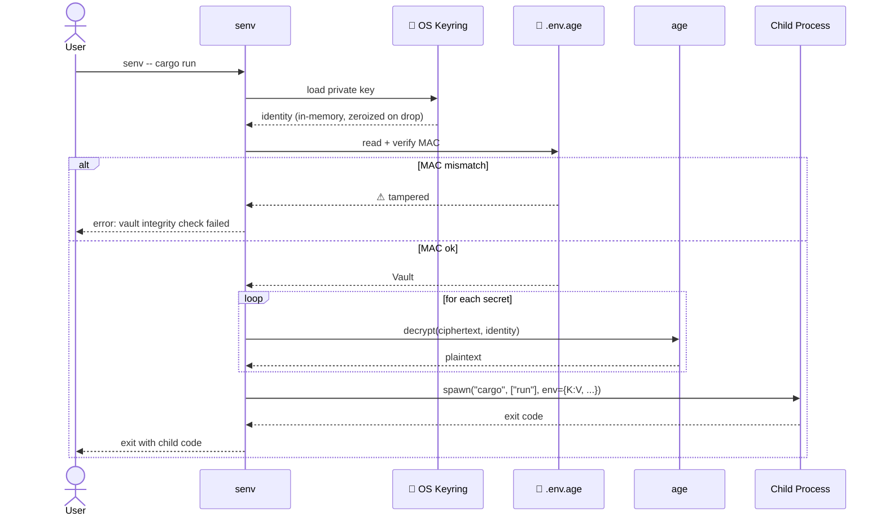
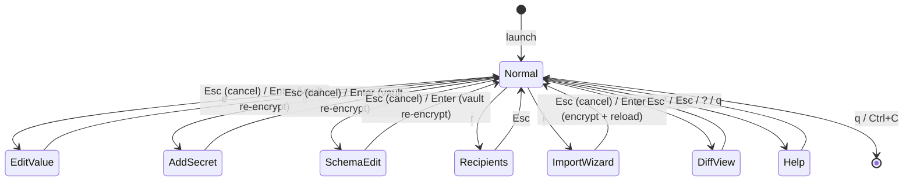
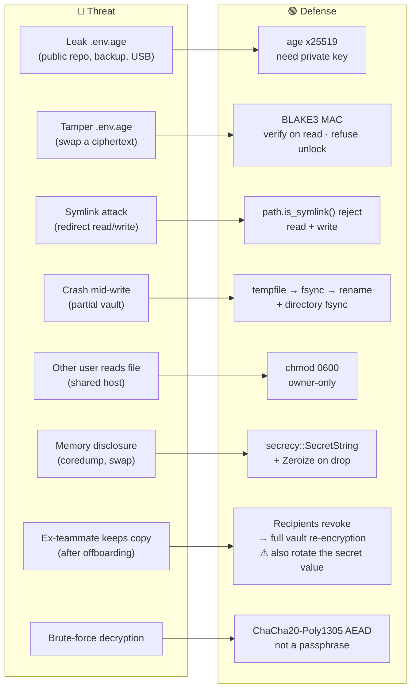

# senv

> Encrypted `.env` replacement with first-class TUI — written in Rust.

**Status**: 🚀 Alpha / functional. All six TUI modals, the CLI exec wrapper, age encryption, OS keyring identity, and multi-recipient sharing are wired end-to-end. 24 unit tests pass.

## Why senv?

Existing tools split into four camps that don't compose:

- **loaders** (`dotenvy`) — convenient, plaintext on disk
- **vaults** (`envy`, `keynest`) — secure, but no `.env` ergonomics
- **git filters** (`git-agecrypt`) — encrypted at rest, opaque at runtime
- **crypto substrates** (`rage`, `age-plugin-yubikey`) — building blocks only

senv combines all four into a single Rust binary with a first-class TUI — a gap that `dotenvx`, `dotenvage`, `envy`, and `murk` each fill only partially.

## Architecture



| Layer | Responsibility | Inspired by |
|---|---|---|
| `tui/` | ratatui interactive interface (the differentiator) | — first of its kind |
| `cli/` | clap subcommands + `senv -- <cmd>` exec wrapper | dotenvx, doppler |
| `core/` | discovery, ops, schema, multi-recipient re-encryption | murk |
| `crypto/` | age x25519, OS keyring identity, lock/unlock | murk + envy |
| `storage/` | atomic file I/O, BLAKE3 MAC, symlink rejection | murk |
| `inject/` | `Command::env` spawn, `eval $(senv export)` | dotenvage + envchain |

## Build

```bash
cargo build --release
./target/release/senv
```

Release binary is ~2.5MB after LTO + strip.

## CLI

```bash
senv init                  # mint age identity, store in OS keyring, create .env.age
senv import .env           # encrypt each entry into the vault
senv list                  # masked list of cwd .env keys
senv diff                  # missing / extra vs .env.example
senv export                # eval $(senv export) shell-compatible output
senv -- cargo run          # spawn child with vault env injected
senv tui                   # interactive TUI (default if no subcommand)
```

### Flow: `senv init`



### Flow: `senv import .env`



### Flow: `senv -- <cmd>`



## TUI

```bash
cargo run                  # or ./target/release/senv
```

| Key | Action |
|---|---|
| `↑↓` / `j` / `k` | Navigate rows |
| `t` / `T` | Cycle env tab |
| `space` | Reveal/mask current value |
| `e` | Edit value (textarea modal, vault re-encrypt on Enter) |
| `a` | Add secret (KEY=VALUE) |
| `s` | Edit schema description (persisted in vault) |
| `r` | Recipients: list / `a` add age1... / `d` revoke + re-encrypt |
| `i` | Import wizard with `.env` preview |
| `D` | Diff vs `.env.example` (Missing/Extra/Match) |
| `L` / `U` | Lock now / Unlock |
| `?` / `F1` | Help overlay |
| `q` / `Ctrl+C` | Quit |

### Modal state machine



## Security model

### Threat → defense mapping



### Key facts

- **At rest**: `.env.age` is JSON wrapping age-encrypted ciphertext per entry, plus a BLAKE3 MAC covering keys + ciphertext + recipient list. Tampering invalidates the MAC and unlock refuses to proceed.
- **At runtime**: private key lives only in the OS keyring (Keychain on macOS, Secret Service on Linux, Credential Manager on Windows). Loaded on unlock, dropped on lock.
- **Atomicity**: every vault write is tempfile → fsync → rename, with the directory also fsynced on Unix. Vault paths are checked for symlinks and refused before reading or writing.
- **Permissions**: written vaults are chmod 0600 on Unix.
- **No plaintext on disk** once you have moved off `.env` (the loader still falls back to `.env` when no vault is present so the wrapper works pre-init).

### Scenarios

| Situation | Outcome |
|---|---|
| `.env.age` pushed to a public repo | 🟢 OK — needs the private key to decrypt |
| Laptop stolen, keyring locked | 🟢 OK — keyring locked, key inaccessible |
| Laptop stolen, screen unlocked | 🔴 Risk — attacker runs `senv`, secrets exposed → auto-lock recommended |
| Vault tampered in transit | 🟢 OK — MAC verify fails, unlock refuses |
| Teammate offboarded (revoked) | 🟡 New commits safe, but old git history still decryptable by their key — **rotate the secret values too** |
| `.env` accidentally committed | ⚫ senv can't prevent this — keep `.env` in `.gitignore` + pre-commit hook |

## Workflow examples

### Adopt senv in a new project

```bash
cd my-rust-app
senv init                       # generate identity + empty vault
senv import .env                # encrypt existing .env into the vault
rm .env                         # plaintext no longer needed
git add .env.age .gitignore
git commit -m "switch to encrypted env"

senv -- cargo run               # daily use
```

### Add a teammate

```bash
# 🧑‍💻 Them (on their machine)
git clone repo && cd repo
senv init                       # they generate their own age key
# share their public recipient via Slack:
# "my recipient is age1ttttgkfg…"

# 🧑‍💻 You
senv                            # TUI → r (Recipients) → a → paste age1ttttgkfg… → Enter
# → vault automatically re-encrypted for both keys
git add .env.age && git commit -m "share with @them" && git push

# 🧑‍💻 Them
git pull && senv                # auto-unlock, secrets visible
```

### Revoke a teammate (and really revoke)

```bash
senv                            # TUI → r → j/k pick → d → vault re-encrypted without them
git add .env.age && git commit -m "revoke @them" && git push

# 🚨 Don't stop there: their old clone can still decrypt past commits.
# Rotate the underlying secret values too (DB passwords, API keys, ...)
# Then edit the new values in senv: TUI → e
```

## Roadmap

Implemented:

- [x] CLI dispatch, TUI shell, layer scaffolding
- [x] `storage/vault_file.rs` — `.env.age` JSON with atomic write + symlink reject + BLAKE3 MAC
- [x] `crypto/identity.rs` — age x25519, keyring-core backend, lock/unlock
- [x] `core/ops.rs` — init / import / list / diff / export
- [x] `inject/exec.rs` — `senv -- cargo run` end-to-end
- [x] EditValue / AddSecret modals
- [x] DiffView modal (.env.example comparison)
- [x] ImportWizard modal
- [x] SchemaEdit modal (description per key, persisted in vault)
- [x] Recipients modal: add by age pubkey + revoke + full vault re-encryption
- [x] Multi-recipient ciphertext (any listed recipient can decrypt)
- [x] Unit tests (24 passing across storage / vault / ops)

Next:

- [ ] `github:user` SSH-key fetch in Recipients add wizard
- [ ] SchemaEdit example + tags fields (currently description only)
- [ ] Personal override (`o` key) writes to vault.scoped
- [ ] CI mode: `SENV_PASSPHRASE` / `SENV_IDENTITY` env var fallback when keyring is unavailable
- [ ] TouchID prompt on first unlock per session
- [ ] Integration tests under `tests/` driving the binary end-to-end
- [ ] `senv set KEY=VAL [--personal]` CLI write
- [ ] `senv vault list` reading the encrypted store directly

## License

MIT OR Apache-2.0
